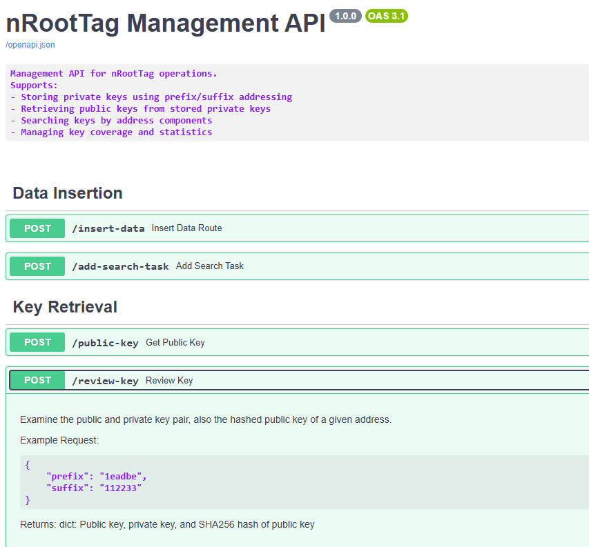
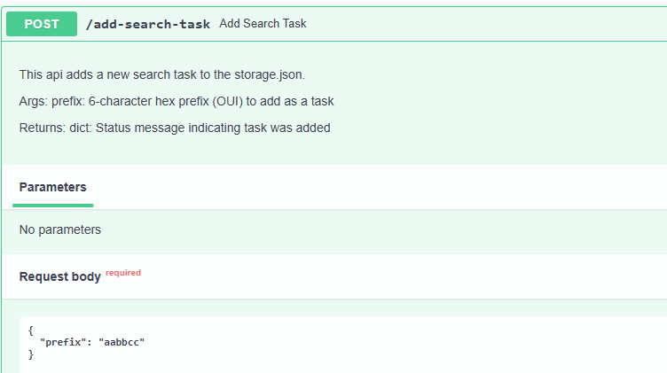
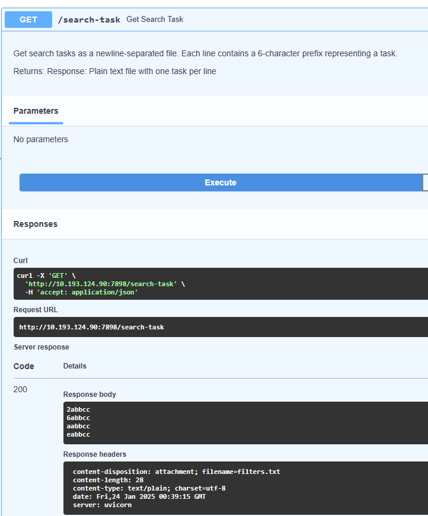
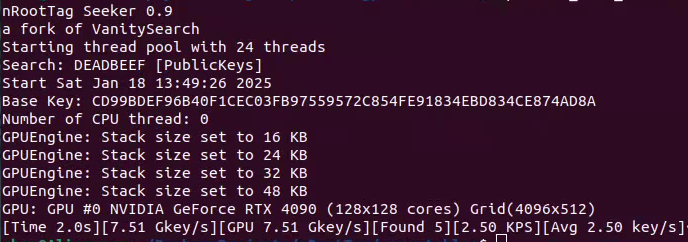
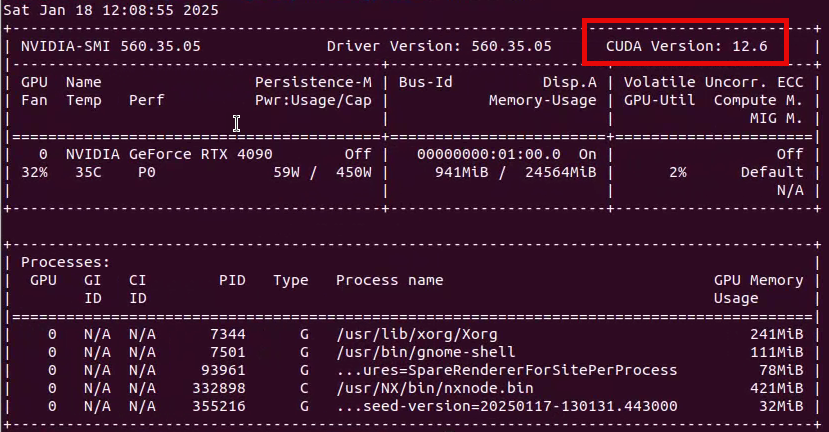
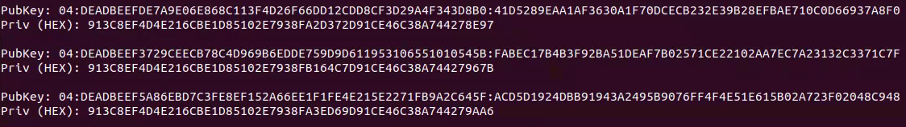
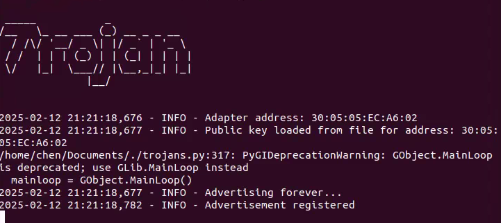
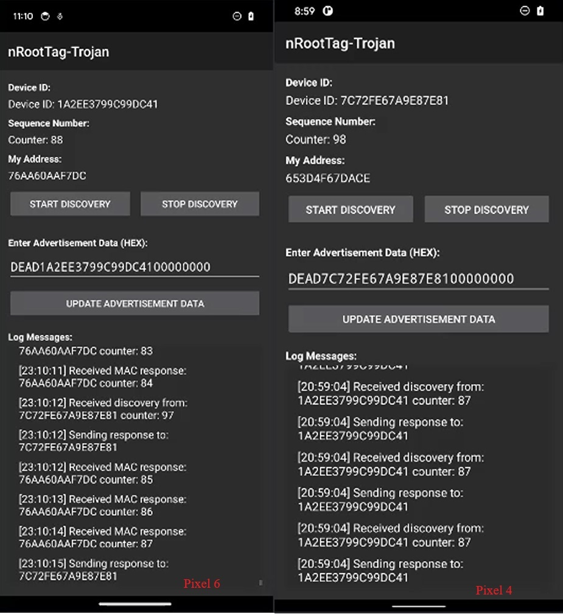
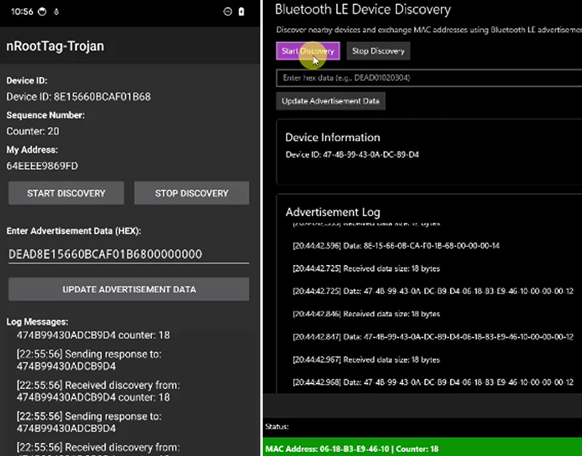
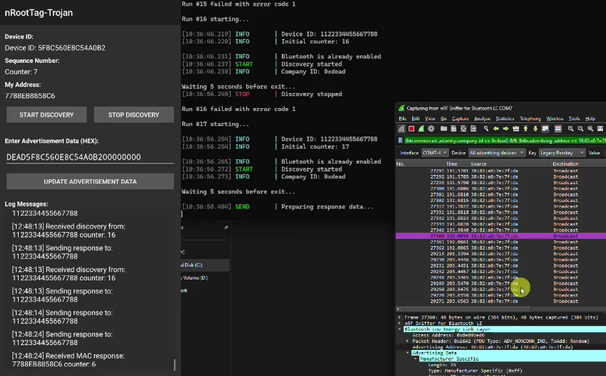

#  nRootTag
[](https://www.gnu.org/licenses/gpl-3.0)


Our work uncovered a vulnerability in the Find My service that permitted all types of BLE addresses for advertising. Leveraging this flaw, we proposed a novel attack method, **nRootTag**, which transformed a computer into an ''AirTag'' tracker without requiring root privilege escalation.

# Table of Contents
- [Environment](#environment)
- [C&C Server](#cc-server)
  - [Setup C&C Server](#setup-cc-server)
  - [Review API Usage Guide](#review-api-usage-guide)
  - [Retrieval of a Private Key](#retrieval-of-a-private-key)
- [Database](#database)
  - [Example Keys and Pre-computed Rainbow Tables](#example-keys-and-pre-computed-rainbow-tables)
  - [Manual Inspection of Rainbow Table](#manual-inspection-of-rainbow-table)
  - [Reconstruct a Public Key](#reconstruct-a-public-key)
- [Seeker](#seeker)
  - [Benchmarking](#benchmarking)
  - [Find a Private Key of a Given OUI](#find-a-private-key-of-a-given-oui)
- [Trojans](#trojan-poc)
- [Report Retrieval](#report-retrieval)
- [Responsible Disclosure & Advisory](#responsible-disclosure--advisory)
- [License and Credits](#license-and-credits)


# Environment

The project forms a complete attack chain and depends on each component working together. The setup might be sophisticated, we thank you for your patience. The project contains the following components: **C&C Server**, **Database**, **Seeker**, and **Trojans** for Linux, Windows, and Android, respectively. Each component can be evaluated separately. 

📺 We provide screen recordings for essential steps, they are available under **ScreenRecording** directory. Due to size constrain of GitHub, please download the screen recordings from [Zenodo](https://doi.org/10.5281/zenodo.14728530). 

The following list shows the system configurations used to construct this readme guide. 

| Component | Requirement |
|-----------|-------------|
| C&C Server | Hardware: Alienware Aurora R5 Desktop<br>OS: Ubuntu 22.04<br>Runtime: Python 3.10 |
| Seeker | Hardware: Alienware Aurora R5 Desktop, NVIDIA RTX 4090<br>OS: Ubuntu 22.04 with CUDA 12 installed |
| Trojan - Linux | Hardware: Alienware Aurora R5 Desktop<br>OS: Ubuntu 22.04 |
| Trojan - Android | Hardware: Pixel 6, Pixel 4<br>OS: Android 13, Android 11 |
| Trojan - Windows | Hardware: Gigabyte Z690, Bluetooth Adapter [RTL8761B](https://www.amazon.com/Enhanced-Adapter-RTL8761B-Chip-Accessory/dp/B0CBTF5MF2)<br>OS: Windows 11 |


# C&C Server

The Command & Control (C&C) server provides APIs for: Rainbow table construction and querying; Search task distribution; and Public key management.

### Setup C&C Server

<span style="color:orange">**Warning:**</span> **Execute this program will open port 7898.**

📺 Screen Recording Available: ScreenRecording/server_db_seeker_trojan_linux.mp4

The C&C Server is written in Python and uses several libraries. We provide two methods to set up the environment; either method should work. 

```bash
# Assume you are under nRootTag
# Method A, install from requirements
python3 -m venv venv
source venv/bin/active
pip install -r requirements.txt

# OR, Method B, use our packed venv
tar xvf venv.tgz
source venv/bin/active

# Lastly, Start Server
python3 cnc_server.py

# After the server started, it will create a web service and listen on port 7898.
# Keep the script running.
```

### Review API Usage Guide

📺 Screen Recording Available: ScreenRecording/server_db_seeker_trojan_linux.mp4, at 1min 15s.

We provide in-line comments and descriptions for future development. You may review the code in `cnc_server.py`, or use a browser and access [http://localhost:7898/docs](http://localhost:7898/docs) to review available APIs and their usage. We present each API with a description and usage examples.

You may use the "Try it out" feature of each API, and follow the in-line descriptions to test its functionality.



### Retrieval of a Private Key

📺 Screen Recording Available: ScreenRecording/server_db_seeker_trojan_linux.mp4, at 2mins 20s.

When looking for a public key for a given address, you can use the `/review-key` API to review the *public key*, private key, and the *base64-encoded SHA256 hashed public key* of that address. For reproduction, click "Try it out," and use the given JSON as input, then click "Execute."

```json
{
  "prefix": "1eadbe",
  "suffix": "112233"
}
```

The output will be,

```json
{
  "public_key": "deadbe1122338f8e8ed9407599d5b24897bb1c3e1f2b12e5cad9b3bb",
  "private_key": "eff87411a86feb4cd51928136014d0ba4be39d0e1fe644e4e5ea5dac",
  "public_key_sha256": "K0LuarPXe8gEvjEjgutpxZllHA8tLEgEATemu8dNWMo="
}
```

Please note, entering `1e` and outputting `de` is expected, as discussed in paper for Attack-II. The Apple Find My network does not distinguish the first 2 MSBs. Therefore, a public key can be used for multiple address types, and we utilize this feature to save storage.

## Cast a New Search

When rainbow tables don't contain your address, you'll need to initiate a new search. You can utilize the `/add-search-task` API to submit your address for searching, followed by executing `python3 seeker_standalone.py`. For an address like `aabbccddeeff`, using `aabbcc` as your search prefix will help locate the exact public key pair corresponding to that address.

```
{
  "prefix": "aabbcc"
}
```



By default, the C&C Server will automatically search equivalent prefixes/addresses. If the input is `aabbcc`, it will add the prefixes `2abbcc`, `6abbcc`, and `eabbcc`. This reduce the complexity from 2^48 to 2^46, in another words, 4x performance. Check `2abbcc.dat` to examine the database. Use the `/search-task` API to verify added prefixes, and modify existing ones through `storage.json`.




# Database

### Example Keys and Pre-computed Rainbow Tables

We provide two pairs of keys to accommodate USENIX 2025 and three pre-computed rainbow tables for inspection and reproduction.

**usenix**
`7573656e69783` is the ASCII of `usenix` in lower-case.

Public Key: <span style="color:orange">7573656e69783</span>7667a9a085ab4bf01b79ffe6c57962a8b977b0b9015 

Private Key: eff87411a86feb4cd51928136014d0aa4c8b9d0e1fe644e4f65ac68d

**USEC25_**

`5553454332355f` is the ASCII of `USEC25_` in upper-case.

Public Key: <span style="color:orange">5553454332355f</span>dd7124d2ae3da5a0e428d1ad47b7adfb2c0381afc4

Private Key: eff87411a86feb4cd51928136014d0b6a1529d0e1fe644e4f59e2745


The following are the pre-computed rainbow tables, you may find them under `collections` directory.

| **OUI / Prefix** | **Meaning**          | **Coverage** |
| ---------------- | -------------------- | ------------ |
| 300505           | One of the Intel OUI | 99.98%       |
| deadbe           | DEADBE               | >99.9985%    |
| 05ec25           | Sec25                | 99.99%       |


### Manual Inspection of Rainbow Table

The database component manages rainbow table storage in the collections directory (collections/*.dat). To evaluate the rainbow tables, you can use the C&C server. Alternatively, you can use a binary tool to locate a private key. To demo the core of our database design, we explain how to check the coupling between a private key and an address manually.

Let’s say you have identified a target address `deadbe112233`  , which shall be treated for two parts.

1. The first part, `deadbe`. The paper explicitly explained the insignificance of the 2 MSBs of the address. You should first convert the first 2 MSBs of the first byte to *0b00* (for example, from `de` to `1e`), then locate the corresponding `.dat` file under the collections directory. As a result, the rainbow table for this address is  `1eadbe.dat`.
2. The second part `112233`. Navigate to the offset of the private key in a binary way. Here is how it is calculated: the 112233 are in hex and you need to convert them to an integer, which is 1122867. This is the index of the private key. For secp224r1, each private key is 28 bytes; therefore, you will need to multiply it by 28 to get the offset, which is 31440276. Lastly, you read out 28 bytes. The private key is then presented to you in big-endian format. You can get the private key with this command:

```bash
# This gives you the private key, not public key.
dd if=collections/1eadbe.dat skip=31440276 bs=1 count=28 2>/dev/null|xxd -p
# Output: eff87411a86feb4cd51928136014d0ba4be39d0e1fe644e4e5ea5dac
```

### Reconstruct a Public Key

After extracting a private key from the rainbow table, you can validate its correctness by using this Python script to compute its public key. You will observe that the first 6 bytes are identical or equivalent to the address we searched for.

The python script is located at `tools/public_key.py`.

```python
from cryptography.hazmat.backends import default_backend
from cryptography.hazmat.primitives.asymmetric import ec

# COPY THE PRIVATE KEY HERE
priv_hex = "eff87411a86feb4cd51928136014d0ba4be39d0e1fe644e4e5ea5dac"

private_key = ec.derive_private_key(
    int(priv_hex, 16),
    ec.SECP224R1(),
    default_backend()
)
private_key_bytes = private_key.private_numbers().private_value.to_bytes(28, byteorder='big')
public_key = private_key.public_key()
public_key_bytes = public_key.public_numbers().x.to_bytes(28, byteorder='big')
print(f"PublicKeyHex: {public_key_bytes.hex()}")

# Output:
# PublicKeyHex: deadbe1122338f8e8ed9407599d5b24897bb1c3e1f2b12e5cad9b3bb
```


We have implemented an automated script to repeat the validation process. You can use our script `tools/rainbow_check.py` to automatically validate the integrity of the rainbow tables. The script will check for any mismatches and missing entries. You could randomly alter any byte offset in range 0 to 469,762,048 bytes of each rainbow table database files, and this script will report the starting offset of the abnormality.


# Seeker

The seeker component requires a CUDA-compatible GPU for efficient key search operations. We strongly recommend using RTX 3080 or RTX 4090, they are well tested during our experiments. We have confidence others NVIDIA GPU with 10GB VRAM would work. To understand the concept, you could use your CPU; however, this will take an enormous amount of time. If you are interested in the details, we have usage guidance and development notes in its own README.

## Benchmarking

You may start with benchmarking its performance by using this command.

```bash
# Assume you are under nRootTag

chmod +x ./executables/Seeker_CUDA_12
./executables/Seeker_CUDA_12 -t 0 -gpu -o /dev/null -p deadbe
# -t 0 means don't use CPU to brute force
# -gpu enables GPU search
# -o save results to a file. Use /dev/null for preventing Disk I/O bottleneck
# -p enable public address search
# deadbeef is the prefix to search.
```




In the screenshot above, you may observe the bottom line showing the status of the program. The time elapsed, current internal speed, average internal GPU speed, found items, current matching per second, average matching per second, respectively. Note, internal speed is not affected by the length or amount of prefix. 

**Note:** If you observe the performance is lower than our paper, we recommend to exit any running GPU intensive programs (e.g., Games, Wallpaper Engines, Screen Recording, etc.,). If you still observe a lower performance (e.g., 7.x Gkey/s on RTX4090 in screenshot), you may restart your workstation and retry. Cloud platforms may have GPU running at containers, which might be a factor of performance unsatisfactory.


### Find a Private Key of a Given OUI

📺 Screen Recording Available: ScreenRecording/server_db_seeker_trojan_linux.mp4, at 3mins.

We have two pre-compiled executables ready for use, which are placed under the executables directory. To run them manually and search for a given prefix of your choice,

1. Identify your CUDA version. `nvidia-smi` will give you a version on top right, use `Seeker_CUDA_11`  if it says 11, or use `Seeker_CUDA_12`  if it says 12.



2. Pick an address of your choice. To have a rapid result, you can try 4 bytes first. For example `deadbeef` . Change -o from /dev/null to output.txt to  create and append results to the `output.txt`.

```python
./executables/Seeker_CUDA_12 -t 0 -gpu -o output.txt -p deadbeef
```


Here is an example line of output, separate by column(`:`). The second column is the public key x-coordinate, the last column is the private key.

```python
04:DEADBEEFFC565D1DD244E9EE622BF227703CE5A4AD6713F5E0FFA564:DE1AB851243647F7D9D387CD18B5888F3B8C6E5760EF9DE63AC5FB64:CD99BDEF96B40F1CEC03FB97561572D51E8191834EBD834CE874B2B4
```

If you prefer to print the results in console, you can remove `-o output.txt`.  The results will look like this.



**Note:** Even with the same prefix used, the private key and public key are very likely different from what we just demonstrated. This is an expected behavior.

In our paper, we have mentioned utilizing 200 GPUs to search concurrently. To test the GPU brokers, you may use one or combination of vast.ai, salad.com, runpod.io at floating price and minute based billing, or use io.net for consistent price and hourly based billing. We do not endorse any of these mentioned platforms, thus, we do not provide integration scripts. We provide the following solutions for your test and integration.

- You may utilize `seeker_standalone.py` to automatically download adequate executable and query C&C server for prefixes to search. To use it, you will just need to run `python3 seeker_standalone.py`, it will download executable and target to search from server, save discovered results, and report to server periodically. This file is also the distributable program for deployment to GPU nodes. 

- You may use Docker to deploy the Seeker container on local machine or cluster. Refer section *Docker Deployment Options* in `executables\nRootTag-Seeker-main.zip\README.md`.


# Trojan PoC
## Attack-I Linux

<span style="color:orange">**Warning:**</span> **Execute this program will attempt to enable your Bluetooth.**

📺 Screen Recording Available: ScreenRecording/server_db_seeker_trojan_linux.mp4, at 7 mins.

To have it working properly, you will need to modify the script and set the address to your host or server IP address. The script is written in python, however, it shall be executed directly in bash. After running the script, it will attempt connect to the C&C server and query for public address that matches this device. A file public_keys.json will be generated with cached public key. You may ignore warning given by GObject.

```bash
chmod +x ./Trojans/trojan_linux.py
bash -c "./Trojans/trojan_linux.py"
```

After execution, the program shows its working state. The program will repeatedly send requests to the server until it successfully receives a public key response. 



**Note:** 

1. The Trojan reads address from your BLE adapter. If your adapter address is different from existed rainbow tables, you will need to initiate a search and find a matching private key pair. 
2. If your C&C server is not localhost, please edit the script and change `server_addr`. 
3. Stealth Enable on Linux requires at least one physical login. Means, if the device has only SSH connection, then it might says "*rfkill: cannot open /dev/rfkill: Permission denied*". Once user login physically, the SSH restriction will be lifted. If the Bluetooth was enabled, the advertisement will be sent anyway. 

## Attack-II Android and Windows

<span style="color:orange">**Warning:**</span> **Execute this program will attempt to enable your Bluetooth.**

Our code demonstrates the feasibility of address identification and exchange on Android and Windows. The programs do not connect to the internet; therefore, you don't need to modify anything to observe their effectiveness. For simplicity, we have provided an Android APK and recommend you try it first before building your own versions with an IDE. 

### Android

📺 Screen Recording Available: ScreenRecording/pixel6-pixel4.mp4

You are encouraged to test with Android first for the most reliable reproduction. After installing the APK and start, the program will ask for permissions. Please grant permissions when application asks. You can click "Start Discovery" and observe the address exchanged in seconds, and the counter will increase overtime.

You may use two Android phones to test the exchange feature. The following screenshot shows successful exchange between Pixel 6 and Pixel 4.



### Windows UWP

📺 Screen Recording Available: ScreenRecording/pixel6-uwp.mp4

The following screenshot shows successful exchange between Pixel 6 and Windows 11 UWP.



### Windows Win32

📺 Screen Recording Available: ScreenRecording/pixel6-win32.mp4

The following screenshot shows successful exchange between Pixel 6 and Windows 11 Win32 Executable.



**Note:** 

1. Some Windows does not have required runtime. You may need to manually install [Microsoft Visual C++ Redistributable](Trojans/VC_redist.x64.exe).
2. We were exploiting the system that it does not release the advertising address. Thus, the program will exit after few seconds. 
Please use the [CMD Script](Trojans/trojan_winrt.bat). It will automatically start the program and repeat the process.


## Source Code Compile
To review and build your own, here are the IDE version info.

**Android**
- Use [Android Studio 2024.2.2](https://developer.android.com/studio)
- Import android directory as project
- Build and run on device for testing

**Windows**

- Use [Visual Studio Community 2022](https://visualstudio.microsoft.com/downloads/)
- Decompress and open solution file
  - UWP: `nRootTag-UWP\nRootTag-UWP\cs\BluetoothAdvertisement.sln`
  - Win32: `nRootTag-WinRT\nRootTag-WinRT\nRootTagWinRT.sln`

- Build for Win32 or UWP for testing
- UWP program require a trusted certificate to run. Using Microsoft issued certificate makes the program distributable on public store. We do not provide UWP executable and ask you kindly compile and run with your Visual Studio.


# Report Retrieval

Report retrieval is not a contribution of this project. We created [Chapoly1305/FindMy](https://github.com/Chapoly1305/FindMy) for our experiment. You may also visit other existed projects on the Internet to retrieve and develop your own retrieval platform. We do not endorse or vouch for any of these projects.

# Responsible Disclosure & Advisory

We have contacted Apple regarding the vulnerability and attack method. Apple has [acknowledged](https://support.apple.com/en-us/121837#:~:text=for%20their%20assistance.-,Proximity,-We%20would%20like) the issue and implementing fix. This code is for academic research and security analysis only. Use responsibly in controlled test environments.


# Research Paper

Please consider sharing and citing our research paper [*Tracking You from a Thousand Miles Away! Turning a Bluetooth Device into an Apple AirTag Without Root Privileges*](https://cs.gmu.edu/~zeng/papers/2025-security-nrootgag.pdf)!


```
@inproceedings{chen2025track,
title={Tracking You from a Thousand Miles Away! Turning a Bluetooth Device into an Apple AirTag Without Root Privileges},
author={Chen, Junming and Ma, Xiaoyue and Luo, Lannan and Zeng, Qiang},
booktitle={USENIX Security Symposium (USENIX Security)},
year={2025}
}
```

# License and Credits

nRootTag uses GPL v3, inherits the license from the original projects. We appreciate the authors for their contributions.

- [OpenHayStack](https://github.com/seemoo-lab/openhaystack) - GPL v3
- [VanitySearch](https://github.com/JeanLucPons/VanitySearch) - GPL v3
- [win-ble-cpp](https://github.com/urish/win-ble-cpp) - MIT
- [Windows-universal-samples](https://github.com/microsoft/Windows-universal-samples) - MIT

